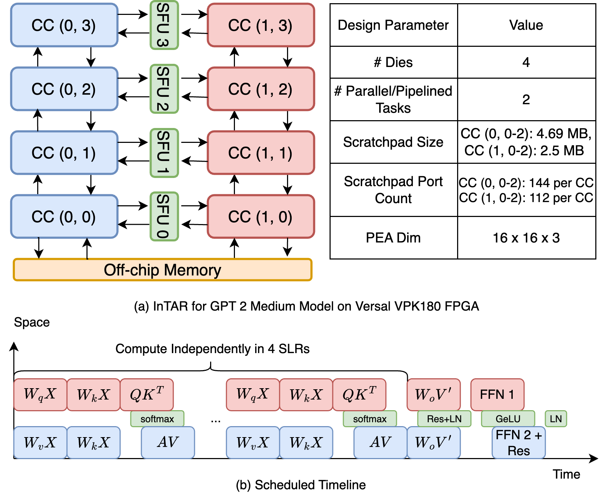

# InTAR: Inter-Task Auto-Reconfigurable Accelerator Design

We propose a novel accelerator design paradigm on FPGAs: inter-task auto-reconfigurable accelerator (InTAR). InTAR can switch execution patterns automatically based on on-chip memory and computation resources. When a task produces large intermediate data, InTAR pipelines multiple tasks to avoid accessing off-chip memory for these data. Otherwise, InTAR will process tasks sequentially to maximize compute efficiency by eliminating pipeline stalls. Compared with other reconfigurable accelerators, InTAR allows model-specific circuit optimization that keeps only necessary control logics and interconnects. Hence, InTAR requires fewer reconfiguration resources, achieves a high clock frequency, and low reconfiguration overhead (10 to 20 ns). Since computations are reconfigured at the task level, InTAR is one of the first works regarding FPGA-based reconfigurable accelerators that support high-level hardware generation tools such as High-Level Synthesis (HLS) for fast accelerator design.

## Project Structure

- `/benchmark`: contains multi-task DNN kernels that are HDV
- `/gpt-2-medium`: HLS code and bitstreams for hardware emulation and on-board execution of GPT-2 Medium model with InTAR

## Dependencies

- Vitis/Vivado 2024.1+ for VPK180
- Vitis/Vivado 2021.2+ for U280
- TAPA: https://github.com/rapidstream-org/rapidstream-tapa
- RapidStream: https://docs.rapidstream-da.com/

## Multi-Task Kernel Testbench

Run `make <kernel-name>-intrra` and `./<kernel-name>-intrra --bitstreams <bitstream-path>` to perform on-board execution on Alveo U280. Similar for sequential and dataflow kernels in the corresponding folders.

## GPT-2 Medium

    

- U280: `make opt350` and `./opt350 <sequence-length> --bitstream bitstreams/opt_kernel_latest.xclbin` to execute an older version of kernel (less optimized, lower frequency). `make opt350-ultrascale` and `./opt350 <sequence-length> --bitstream bitstreams/opt_kernel_xilinx_u280_full.xclbin` for an optimized version of kernel.

- VPK180: Follow [this documentation](/gpt-2-medium/README.md) to generate custom platform, run hardware emulation using QEMU, and perform bitstream generation.
